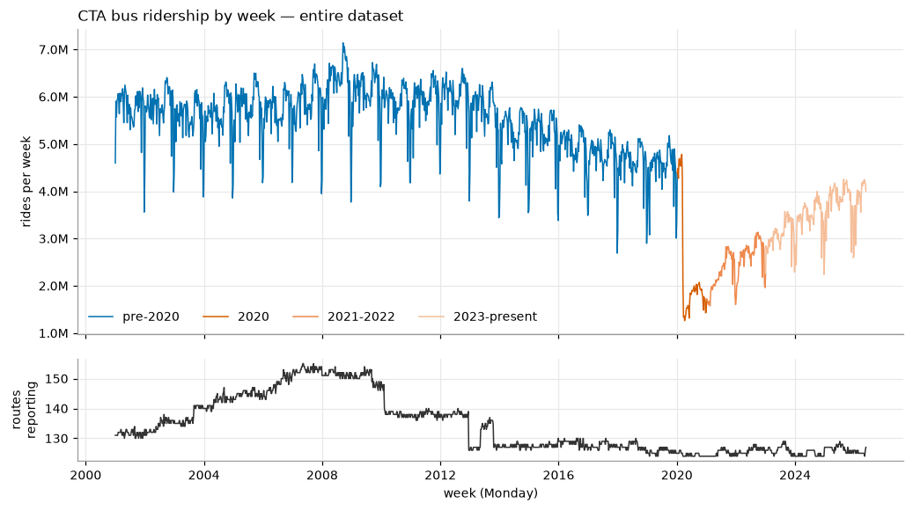

# CTA's Frequent Network — did the 10-minute promise hold?

Between March and December 2025 the CTA phased 20 bus routes into a **Frequent Network**,
advertising waits of 10 minutes or less. This repository asks two questions about that.

**1. Service delivered.** The CTA ads promised 10 minutes or better, 6am–9pm weekdays,
9am–9pm weekends. But how often is that true? We can use real bus data to find out, comparing
scheduled service with the service we, as riders, actually experience. We understand that
without dedicated bus lanes, signal priority, etc. these ads aren't realistic, but putting
numbers to the data and seeing what needs to be improved is a good first step.

**2. Ridership.** To what extent, if any, has ridership responded to the creation of the
network? Does ridership signal, if any, show dependency on actual service or advertised/
scheduled service?

To answer these questions we first need to understand the available data; several notebooks
below are dedicated to that.

## Status: in progress

Nothing here is a finding yet. Question 1 is being built and checked on one route (66) before
it runs at scale; question 2 has not been restarted. `frequent_network_analysis.ipynb` was
agent-generated — its conclusions are unverified and its data selections not all visible, so
treat every number in it as provisional.

Ground rule for the rebuild: every filter or transformation happens in a visible cell and prints
what it did, and checks report their counts even when the count is zero.
`ten_minute_promise.ipynb` ends with a section listing what in it is unverified, untested, or
known wrong.

## Layout

**Understanding the data**

- **`data_inventory.ipynb`** — start here. What is on disk, an example file from each source and
  how to re-fetch it, the four route-geometry files, and a look at any route's stops.
- `exploration.ipynb` — system-wide ridership: integrity checks and cross-checks, corridors,
  total and per-route ridership, per-era statistics, day-of-week structure. Writes
  `data/derived/` for the two below.
- `holidays.ipynb` — which days CTA actually runs a holiday schedule on, and how much ridership
  changes when it does. Needs `exploration.ipynb`.
- `seasonality.ipynb` — the within-year profile, trend removed and holiday weeks held out, and
  whether it pools across eras. Needs both of the above.

**Question 1 — service**

- **`ten_minute_promise.ipynb`** — builds headways from actual arrivals one visible step at a
  time, checks them against the raw 5-minute pings, and reports the gap distribution and the
  wait a rider actually experiences. Currently route 66.
- `build_pid_directions.py` — writes `data/derived/pid_directions.csv`, the pattern → direction
  table, by joining StopWatch timetables to GTFS. Run once for the whole network (~80s); doing
  it inline costs ~20s per busy route. Exits non-zero rather than write an inconsistent table.
- `fetch_stopwatch.py` — downloads the realised-service archive (below). Resumable; `--dry-run`
  sizes a pull before it moves any data.

**Question 2 — ridership**

- `frequent_network_analysis.ipynb` — the earlier route-level difference-in-differences writeup.
  Being replaced; kept for reference.
- `analyze.py`, `inference_proto.py`, `build_notebook.py`, `check_r_routes.py` — supporting
  scripts for that notebook. `output/` holds its CSV summaries and figures.

**Shared code and documentation**

- `ctabus.py` — what more than one notebook needs, so copies cannot drift: plot style, paths into
  `data/`, file-inspection helpers, route-shape and stop loaders. Writes nothing to disk.
- `docs/fn-analysis-plan.md` — the question-2 rebuild plan: hypotheses fixed before outcomes are
  examined, design parameters, correction layers, and the decisions still outstanding.
- `docs/bus-tracker-data-plan.md` — acquisition plan for realised frequency: source inventory,
  what to pull where, known hazards, and the calibration that comes before any claim.
- `docs/methods.md` — derivations and references. Currently headways and rider wait; new
  statistical methods go here rather than expand inline.
- `docs/cta-advertised-service-increases.md`, `docs/ridership-restatement-notes.md`,
  `docs/CTA_MEMO_Ridership_Update_2026-03-20.pdf` — CTA's own published statements, kept as sources.

## Data

Nothing here is committed (`data/` is gitignored, and is a symlink to a larger disk). All of it
is public and regenerates from the sources below.

**Daily totals by route** → `data/cta_bus_daily.csv` (47MB)
[CTA Ridership – Bus Routes – Daily Totals by Route](https://data.cityofchicago.org/Transportation/CTA-Ridership-Bus-Routes-Daily-Totals-by-Route/jyb9-n7fm/about_data)
(`jyb9-n7fm`). Columns `route`, `date`, `daytype` (`W` weekday, `A` Saturday, `U` Sunday/holiday),
`rides`. Covers 2001-01-01 to 2026-05-31, 188 routes.

```
curl "https://data.cityofchicago.org/resource/jyb9-n7fm.csv?\$limit=2000000" \
     -o data/cta_bus_daily.csv
```



Twenty-five years of weekly boardings from that file: ~6M/week through the 2000s, a slow decline
to ~5M by 2019, the 2020 collapse to 1.3M, and a recovery that has reached ~4.2M. The lower panel
is the number of routes reporting, which moves enough that no system total can be read without it.

**Monthly day-type averages, with route names** → `data/cta_bus_monthly.csv` (3MB)
[CTA Ridership – Bus Routes – Monthly Day-Type Averages & Totals](https://data.cityofchicago.org/Transportation/CTA-Ridership-Bus-Routes-Monthly-Day-Type-Averages/bynn-gwxy)
(`bynn-gwxy`). Supplies the route names the daily file lacks, and cross-checks our aggregation.

```
curl "https://data.cityofchicago.org/resource/bynn-gwxy.csv?\$limit=50000&\$order=route,month_beginning" \
     -o data/cta_bus_monthly.csv
```

**Route geometry** → `data/geo/` — downloaded by `exploration.ipynb` §4.a if missing, so no
manual step is needed. Two files, because routes move:

- [CTA - Bus Routes](https://data.cityofchicago.org/Transportation/CTA-Bus-Routes/6uva-a5ei/about_data)
  (`6uva-a5ei`), updated 2025-01-08 — 127 routes, the current network.
- [CTA - Bus Routes - KML](https://data.cityofchicago.org/Transportation/CTA-Bus-Routes-KML-Deprecated-February-2015-/atza-xq2n)
  (`atza-xq2n`), deprecated 2015-02 — 140 routes, the only historical geometry the portal keeps.
  Adds 22 discontinued routes the current file has dropped.

Together they cover 149 of the 188 routes in the ridership data. The 39 without geometry —
`R` shuttles, `X` expresses, special-event IDs — are 8.5% of summed mean riders/day, and are
absent from the map and the lifespan panels rather than placed on a guess.

### Realised service — Mansueto StopWatch

The ridership files carry no service measure, so *delivered* frequency comes from the
[Mansueto Institute's StopWatch](https://github.com/mansueto-institute/cta-stop-watch) archive,
which continues the [Chi Hack Night Ghost Buses](https://github.com/chihacknight/chn-ghost-buses)
scrape: CTA Bus Tracker polled every 5 minutes since 2022-05-19, interpolated to stop-level
arrivals, plus CTA's own GTFS accumulated into historic timetables.

| Product | `--what` | Size | Coverage |
|---|---|---|---|
| Actual arrivals, per pattern | `processed` | 34.4 GB | 886 patterns |
| Scheduled arrivals, per route | `timetables` | 13.8 GB | 124 routes |
| Their summary metrics | `metrics` | 357 MB | one file |
| Raw 5-minute pings | `raw` | 50.6 GB | 1529 days, no gaps |

Sizes measured 2026-08-05; the pipeline runs daily, so they grow. Requires `pyarrow`.

```
python fetch_stopwatch.py --what timetables --dest data/stopwatch --dry-run
python fetch_stopwatch.py --what processed  --dest <big-disk>
```

Arrival times in `processed_by_pid/` are **estimated, not observed** — interpolated between
5-minute pings. `data_inventory.ipynb` §2a quotes the upstream code that does it, and
`ten_minute_promise.ipynb` §3 checks the result against the raw pings.

Read [`docs/bus-tracker-data-plan.md`](docs/bus-tracker-data-plan.md) before pulling — it
covers which products are actually needed, the pattern-churn hazard, and what has to be
calibrated on control routes before any number is quoted.

## Running

Use the `divvy-cta` conda environment (pandas 3.0.5) — base anaconda is two major versions
behind and is not what these notebooks were run against. Dependencies are not yet pinned.

```
conda activate divvy-cta
jupyter lab data_inventory.ipynb
```

`data_inventory.ipynb` and `ten_minute_promise.ipynb` stand alone, except that
`ten_minute_promise.ipynb` wants `data/derived/pid_directions.csv` — build it once with
`python build_pid_directions.py`, or let the notebook do the join itself, slowly.

The ridership notebooks run in order: `exploration.ipynb`, then `holidays.ipynb`, then
`seasonality.ipynb`. The first writes `data/derived/daily.csv` and `route_inventory.csv`; the
second writes `data/derived/holiday_calendar.csv`, which the third reads. All of it regenerates
by re-running the notebooks.

Notebook outputs are stripped on commit by [`nbstripout`](https://github.com/kynan/nbstripout),
configured in `.gitattributes`, so the repository stays small. Your working copy keeps its
figures; the committed version does not. After cloning, enable the filter once:

```
nbstripout --install --attributes .gitattributes
```

## Frequent Network rollout

Four phases, from [Streetsblog Chicago](https://chi.streetsblog.org/2025/03/05/10-minute-version-cta-promises-shorter-headways-on-20-bus-routes-there-are-a-bunch-of-reasons-riders-hope-the-plan-will-work-out)
and CTA press releases:

| Effective | Routes |
|---|---|
| 2025-03-23 | J14, 34, 47, 54, 60, 63, 79, 95 |
| 2025-06-15 | 4, 49, 66 |
| 2025-08-17 | 20, 53, 55, 77, 82 |
| 2025-12-21 | 9, 12, 72, 81 |

Sources conflict on whether #53 and #20 joined in June or August. Program definition — 10 minutes
or better, 6a–9p weekdays / 9a–9p weekends — is on the
[CTA Frequent Network page](https://www.transitchicago.com/frequent/).
